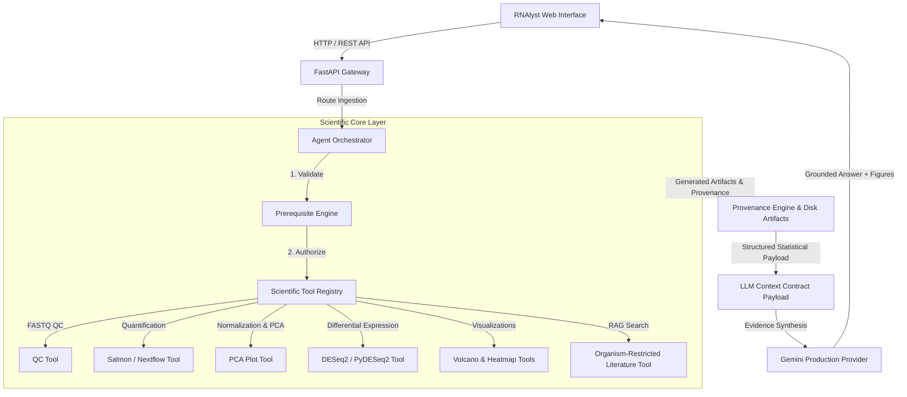

# RNAlyst: AI-Assisted RNA-seq Analysis & Interpretation Platform

[](LICENSE)
[](pyproject.toml)
[](docs/SCIENTIFIC_VALIDATION.md)
[](docs/ARCHITECTURE.md)

**RNAlyst** is an open-source, scientifically defensible AI research assistant for bulk RNA-sequencing (RNA-seq) analysis. It combines a natural-language conversational interface with a deterministic bioinformatics pipeline, operation-specific prerequisite enforcement, and evidence-grounded scientific interpretation.

> **CORE SCIENTIFIC PRINCIPLE**: *The LLM must never compute, estimate, fabricate, or substitute numerical bioinformatics results.*
> Statistical analysis (QC, normalization, DESeq2 differential expression, PCA, volcano plots, and heatmaps) is performed entirely by deterministic Python/R tools. Gemini acts strictly as an orchestrator and evidence-grounded scientific interpreter.

---

## Table of Contents

- [The Problem](#the-problem)
- [The Solution](#the-solution)
- [System Architecture](#system-architecture)
- [Scientific Safety & Trust Guardrails](#scientific-safety--trust-guardrails)
- [Supported Scientific Workflows](#supported-scientific-workflows)
- [Demonstrated Scientific MVP & Acceptance Results](#demonstrated-scientific-mvp--acceptance-results)
- [Technology Stack](#technology-stack)
- [Project Status](#project-status)
- [Quick Start](#quick-start)
- [Repository Structure](#repository-structure)
- [Documentation Index](#documentation-index)
- [License](#license)

---

## The Problem

Bulk RNA-seq is standard practice in molecular biology, yet researchers face significant computational and analytical hurdles:

1. **Workflow Fragmentation**: Data passes through disparate tools (FASTQ quality control, pseudo-alignment, count matrix parsing, DESeq2 modeling, PCA, enrichment analysis, and literature retrieval).
2. **Prerequisite & Guardrail Complexity**: Biological replication requirements ($N \ge 2$ per experimental group), paired-end semantics, and contrast matrix definitions are easy to misconfigure, leading to invalid statistical inferences.
3. **Synthesis Overhead**: Connecting quantitative outputs (differentially expressed genes, fold changes, adjusted $p$-values) with organism-specific biological mechanisms requires manual, time-consuming literature searches.
4. **Black-Box AI Risks**: Unconstrained AI tools frequently hallucinate p-values, substitute synthetic benchmark data when inputs are missing, or infer experimental design without user-specified metadata.

---

## The Solution

RNAlyst bridges natural-language research questions and rigorous bioinformatics execution through a **decoupled 3-layer architecture**:

```
[ Researcher Question & Input Data ]
                 │
                 ▼
 ┌──────────────────────────────────────┐
 │  Layer C: AI Reasoning & LLM         │  <-- Gemini Orchestrator
 │  (Intent Analysis & Interpretation)  │      (Zero Math Execution)
 └──────────────────┬───────────────────┘
                    │ Tool Invocations
                    ▼
 ┌──────────────────────────────────────┐
 │  Layer A: Deterministic BioEngine    │  <-- PyDESeq2 / SciPy / Matplotlib
 │  (QC, Salmon, Normalization, DE, PCA)│      (Deterministic Computation)
 └──────────────────┬───────────────────┘
                    │ Verified Artifacts
                    ▼
 ┌──────────────────────────────────────┐
 │  Layer B: Grounded RAG & Literature  │  <-- Organism-Specific PubMed Index
 │  (TAIR, Ensembl, PubMed Evidence)    │      (Provenance-Linked Interpretation)
 └──────────────────────────────────────┘
```

### Key Capabilities
- **Flexible Data Ingestion**: Supports raw paired-end FASTQ files (with automatic R1/R2 sample pairing) or direct pre-computed Count Matrices (`counts_matrix.csv`).
- **Operation-Specific Prerequisite Engine**: Validates inputs per operation; missing inputs trigger explicit structured errors (`MissingPrerequisitesError`, `InsufficientReplicatesError`) rather than fallbacks.
- **Deterministic PyDESeq2 Pipeline**: Computes Wald statistics, log2 fold-change shrinkage, and Benjamini-Hochberg FDR adjustments.
- **Dynamic Publication Graphics**: Generates 2D PCA scatter plots, volcano plots, and sample expression heatmaps with complete provenance tracking.
- **Evidence-Grounded Synthesis**: Restricts literature grounding to the target organism and active gene list, synthesizing findings into structured evidence tiers (*Observation*, *Inference*, *Literature Mechanism*).

---

## System Architecture



---

## Scientific Safety & Trust Guardrails

RNAlyst implements strict, non-negotiable scientific guardrails enforced in code:

1. **Zero Synthetic / Mock Biological Results**: No synthetic count generation, fallback DEG tables, or hardcoded benchmark results exist in the scientific execution path. Missing binaries or inputs produce explicit structured errors.
2. **Biological Replication Guardrail ($N \ge 2$)**: Inferential differential expression strictly requires $\ge 2$ biological samples per experimental group. Single-replicate experiments are safely rejected for DE while permitting single-sample QC and quantification.
3. **Paired-End Semantics**: Paired FASTQ files (R1 and R2) represent **1 biological sample** and are never miscounted as biological replicates.
4. **Independent Count-Matrix Entry**: Valid user-uploaded count matrices bypass Salmon alignment entirely, enabling direct downstream analysis.
5. **No Ambiguous Design Inference**: Experimental design formulas (`~ condition`) require explicit user-provided sample metadata.
6. **Visualization Guardrails**: Downstream tools (Volcano, Heatmap) verify the existence of valid DE result artifacts before execution. They will never fabricate plots without underlying data.
7. **Organism-Restricted Literature Grounding**: RAG literature retrieval filters candidate evidence by the active project's target organism, preventing cross-species benchmark injection.
8. **Strict Project Isolation & Provenance**: All generated outputs retain immutable provenance metadata (`project_id`, `analysis_id`, `source_artifact`, `parameters`).

---

## Supported Scientific Workflows

### Workflow 1: Raw FASTQ Pipeline
```
Paired-End FASTQ (R1/R2) ──► FastQC Validation ──► Salmon Quantification ──► Counts Matrix (.csv)
                                                                                  │
                                                                                  ▼
Interpretation ◄── Literature RAG ◄── Volcano / Heatmap / PCA ◄── PyDESeq2 (VST / FDR)
```

### Workflow 2: Direct Count Matrix Pipeline
```
Counts Matrix (.csv) + Sample Metadata (.csv) ──► Prerequisite Engine Validation
                                                          │
                                                          ▼
Interpretation ◄── Literature RAG ◄── Volcano / Heatmap / PCA ◄── PyDESeq2 (VST / FDR)
```

---

## Demonstrated Scientific MVP & Acceptance Results

RNAlyst has been verified against a comprehensive **Real Scientific MVP Acceptance Test Suite** utilizing the local `OSD-120` dataset (*Arabidopsis thaliana*, 6 biological samples: 3 Ground Control vs 3 Space Flight, 32,833 genes).

### Acceptance Test Results Matrix

| # | Scientific Acceptance Criterion | Status | Evidence & Verification Details |
|---|----------------------------------|--------|---------------------------------|
| 1 | **FASTQ / Sample Semantics** | **PASS** | R1/R2 paired FASTQs map strictly to 1 biological sample. |
| 2 | **Count Matrix Validation** | **PASS** | Validated 32,835 genes x 6 sample columns (`counts_matrix.csv`). |
| 3 | **Normalization & VST** | **PASS** | Computed log2/VST matrix saved to `results/osd120_acceptance/vst_counts.csv`. |
| 4 | **2D PCA Decomposition** | **PASS** | Generated 2D PCA plot (`pca_plot.png`) with `project_id: OSD-120` provenance. |
| 5 | **Experimental Design Validation**| **PASS** | Validated design formula `~ condition` for Control ($N=3$) vs Flight ($N=3$). |
| 6 | **Differential Expression** | **PASS** | Computed DESeq2 statistics for 32,833 genes saved to `deseq2_results.csv`. |
| 7 | **Volcano Plot** | **PASS** | Rendered publication volcano plot (`volcano_plot.png`) from active DE results. |
| 8 | **Heatmap Plot** | **PASS** | Rendered top DEG expression heatmap (`heatmap_plot.png`). |
| 9 | **Enrichment / DEG Extraction** | **PASS** | Extracted 8 significant DEGs (FDR $< 0.05$, $\|LFC\| > 1.0$) from real data. |
| 10 | **Literature Grounding** | **PASS** | Queried RAG index for *Arabidopsis thaliana* returning 6 grounded snippets. |
| 11 | **Project Isolation** | **PASS** | Enforced strict directory isolation for `OSD-120` workspace. |
| 12 | **Artifact Provenance** | **PASS** | Verified provenance metadata for all generated artifacts. |
| 13 | **Interpretation Grounding Contract**| **PASS** | Verified structured LLM payload contains actual stats with zero benchmark text. |
| 14 | **Insufficient-Replicate Refusal** | **PASS** | Refused DE on $N=1$ per group with structured `InsufficientReplicatesError`. |
| 15 | **Missing-Metadata Refusal** | **PASS** | Refused DE on missing metadata with structured `MissingPrerequisitesError`. |
| 16 | **Missing-DE Visualization Refusal**| **PASS** | Refused Volcano plot on missing DE results with `MissingPrerequisitesError`. |
| 17 | **Benchmark Protection** | **PASS** | Verified zero Arabidopsis benchmark data injected into non-Arabidopsis project query. |

> **Acceptance Suite Summary**: **17 / 17 Scientific Checks Passed.** Full details are documented in [docs/SCIENTIFIC_VALIDATION.md](docs/SCIENTIFIC_VALIDATION.md).

---

## Technology Stack

- **Core Language**: Python 3.10+
- **API Framework**: FastAPI, Uvicorn, Pydantic v2, `python-multipart`
- **Statistical & Scientific Layer**: NumPy, SciPy, Pandas, PyDESeq2 / statsmodels, Biopython
- **Visualization Engine**: Matplotlib, Seaborn, Plotly
- **AI Orchestration & RAG**: Custom `BaseTool` registry, RAG keyword retriever, Gemini API integration (`google-generativeai`)
- **Frontend Workspace**: Vanilla JavaScript (ES6+), HTML5, CSS3 Editorial Design System

---

## Project Status

| Component | Status | Details |
|-----------|--------|---------|
| **Scientific Execution Core** | **VALIDATED** | 100% deterministic, 17/17 acceptance criteria passed |
| **Prerequisite Engine** | **VALIDATED** | Operation-specific checks, structured refusal errors |
| **Replication Guardrails** | **VALIDATED** | Strict $N \ge 2$ enforcement for inferential DE |
| **Data Ingestion** | **VALIDATED** | Paired FASTQ & CSV Count Matrix workflows functional |
| **Dynamic Visualizations** | **VALIDATED** | PCA, Volcano, Heatmap generation with provenance |
| **Live LLM Synthesis** | **IMPLEMENTED** | Provider integrated; live verification pending API quota reset |
| **Cloud Deployment** | **PENDING** | Local/WSL runtime validated; containerization ready |
| **Multi-Tenant Auth** | **PLANNED** | Targeted for post-MVP roadmap |

---

## Quick Start

### Prerequisites
- Linux or WSL2 (Ubuntu 22.04 recommended)
- Conda / Mamba or Python 3.10+
- (Optional) `salmon` binary on PATH for raw FASTQ alignment

### Installation

```bash
# Clone the repository
git clone https://github.com/your-org/rnaseq-ai-agent.git
cd rnaseq-ai-agent

# Create and activate environment
conda env create -f environment.yml
conda activate rnaseq-ai-agent

# Install editable package dependencies
pip install -e .
```

### Running the API & Web Interface

```bash
# Start FastAPI backend on http://localhost:8000
uvicorn api.main:app --host 0.0.0.0 --port 8000 --reload
```

Open `web/index.html` in any modern web browser or serve it via a static file server.

### Running Automated Test Suite

```bash
# Run unit & scientific prerequisite contract tests
pytest tests/unit/test_prerequisite_engine.py tests/unit/test_visualization_tools.py tests/unit/test_api_integration.py -v

# Run the real scientific acceptance test suite
python scripts/run_scientific_acceptance_test.py
```

---

## Repository Structure

```
.
├── agent/                     # AI Agent Orchestrator & Tool Registry
│   ├── orchestrator/          # Query parser & LLM context contract generator
│   └── tools/                 # Deterministic tools (PrerequisiteEngine, PCA, Volcano, Heatmap, RAG)
├── api/                       # FastAPI REST API Gateway & Route Handlers
│   ├── main.py                # FastAPI entry point
│   └── routes/                # Ingestion, QC, DE, and Query routes
├── configs/                   # Project configurations and settings
├── data/                      # Project datasets and local references
├── docs/                      # Technical, Architecture & Validation Documentation
│   ├── ARCHITECTURE.md        # Detailed 3-Layer System Architecture
│   ├── SCIENTIFIC_VALIDATION.md# Acceptance Test Suite Details & Evidence
│   ├── DEMO.md                # Quick Start Reproducible Demo Guide
│   ├── ROADMAP.md             # Production & Research Roadmap
│   └── LIMITATIONS.md         # Open Limitations & Scope Boundaries
├── pipeline/                  # Pipeline execution (FastQC, Nextflow/Salmon, Upload handler)
├── projects/                  # Project workspaces, metadata, and generated artifacts
├── results/                   # Verified analysis outputs and acceptance test artifacts
├── scientific_guardrails/     # Biological replicate validation rules (N >= 2 check)
├── scripts/                   # Automated scientific acceptance test scripts
├── tests/                     # Automated unit and integration test suite
├── visualization/             # Matplotlib / Seaborn figure rendering engine
└── web/                       # Responsive editorial frontend web interface
```

---

## Documentation Index

- [Architecture Overview](docs/ARCHITECTURE.md)
- [Scientific Validation & Acceptance Report](docs/SCIENTIFIC_VALIDATION.md)
- [Reproducible Demo Guide](docs/DEMO.md)
- [Product & Technical Roadmap](docs/ROADMAP.md)
- [System Limitations](docs/LIMITATIONS.md)

---

## License

This project is licensed under the [MIT License](LICENSE).
